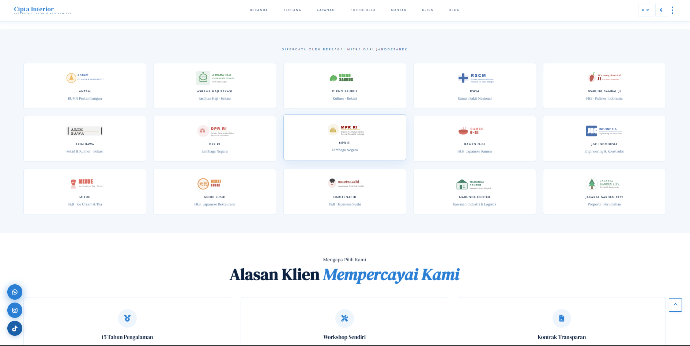

# Cipta Interior — Website Resmi

Website profil bisnis dan portofolio untuk **Cipta Interior**, produsen kitchen set custom dan jasa desain interior di Bekasi.

🌐 **Live:** [ciptainterior.rf.gd](https://ciptainterior.rf.gd)

---

## Preview



---

## Tentang Proyek

Website ini dibangun dari nol tanpa framework frontend maupun CSS framework. Semua ditulis manual — mulai dari desain system tokens, animasi, lightbox, slider, hingga REST API backend-nya.

Fitur utama:
- Profil perusahaan & layanan
- Portofolio dinamis (upload/delete via admin panel)
- Blog statis (6 artikel)
- Form kontak
- Admin panel dengan JWT auth
- Dark/light mode + bilingual (ID/EN)

---

## Tech Stack

| Layer | Detail |
|---|---|
| **Frontend** | Vanilla JS ES6+, HTML5, Custom CSS |
| **CSS** | Pure custom CSS dengan design tokens (`--variable`), tanpa Bootstrap/Tailwind |
| **Backend** | PHP (PDO, `finfo`, `password_hash`) — min PHP 7.4, dijalankan di PHP 8.x |
| **Database** | MySQL via PDO — InfinityFree (`sql112.infinityfree.com`) |
| **Auth** | Custom JWT HS256 (hand-rolled, tanpa library) — token disimpan di `sessionStorage` |
| **Font** | Google Fonts: `DM Serif Display`, `Lora`, `Josefin Sans` |
| **Icon** | Font Awesome v6.5.0 (CDN) |
| **Hosting** | InfinityFree — domain `ciptainterior.rf.gd` |
| **SEO** | `sitemap.xml`, `robots.txt`, JSON-LD Schema, Open Graph, Twitter Card |

> Tidak ada npm, tidak ada Composer, tidak ada jQuery, tidak ada React/Vue. 100% hand-written.

---

## Struktur File

```
htdocs/
├── .htaccess                        # Router utama: clean URL, security, caching, GZIP
├── index.html                       # Halaman beranda
├── about.html                       # Tentang kami
├── services.html                    # Layanan
├── portofolio.html                  # Portofolio (data dari API)
├── contact.html                     # Form kontak
├── client.html                      # Klien kami
├── blog.html                        # Halaman listing blog
├── robots.txt
├── sitemap.xml
│
├── blog/                            # Artikel blog (static HTML)
│   ├── index.html                   # Listing blog (copy dari blog.html)
│   ├── kitchen-set-minimalis.html
│   ├── harga-kitchen-set-bekasi.html
│   ├── desain-interior-residensial.html
│   ├── furnitur-custom-material.html
│   ├── interior-hotel-jabodetabek.html
│   └── renovasi-total-ruang-tamu.html
│
├── api/
│   ├── api.php                      # REST API backend (JWT, portofolio, kontak)
│   └── .htaccess
│
├── admin/
│   ├── admin.php                    # Admin panel (session-based, dev/local)
│   └── .htaccess
│
├── assets/
│   ├── css/style.css                # Semua styling (~2000 baris, custom design tokens)
│   ├── js/script.js                 # Semua JS (~1550 baris, vanilla ES6+)
│   └── img/
│
└── uploads/
    └── portfolio/                   # Hasil upload gambar portofolio
```

---

## Penjelasan File Utama

### `.htaccess`
Router utama Apache. Bertanggung jawab atas:
- **Clean URL** — `/blog` → `blog.html`, `/blog/slug` → `blog/slug.html`
- **Canonical redirect** — `/foo.html` → `/foo` (301)
- Proteksi file sensitif (`.env`, `.sql`, `.json`, dll)
- Hotlink protection gambar
- GZIP compression & browser caching
- Security headers (`X-Frame-Options`, `X-XSS-Protection`, dll)

### `api/api.php`
REST API backend. Endpoint via `?action=`:

| Action | Auth | Fungsi |
|---|---|---|
| `login` | — | Verifikasi bcrypt, return JWT token |
| `get_portfolio` | — | Ambil data portofolio (paginated, filterable) |
| `upload_portfolio` | JWT | Upload gambar + simpan ke DB |
| `delete_portfolio` | JWT | Hapus item portofolio dari DB + file |
| `send_contact` | — | Simpan pesan kontak ke DB |
| `get_image` | — | Proxy gambar (legacy) |

Rate limiting: 10 request / 15 menit per IP (disimpan di DB).

### `assets/js/script.js`
Semua logika frontend dalam satu file (vanilla JS, `'use strict'`):

| Modul | Fungsi |
|---|---|
| Theme | `initTheme()`, `toggleTheme()` — dark/light, persist ke `localStorage` |
| Language | `initLang()`, `toggleLang()` — bilingual ID/EN via `data-i18n` |
| Scroll | `initScroll()` — sticky nav, progress bar, back-to-top |
| Reveal | `initReveal()` — scroll-reveal via `IntersectionObserver` |
| Portfolio | `loadPF()`, `renderPF()` — fetch & render dari API |
| Lightbox | `openLbx()`, `closeLbx()`, `lbxNav()` — lightbox dengan navigasi |
| Slider | `renderTS()`, `initDrag()` — testimonial slider (touch/mouse swipe) |
| Before/After | `initBASlider()` — drag comparison slider |
| Auth | `doLogin()`, `adminLogout()` — JWT login via API |
| Upload | `uploadItem()`, `initFileUpload()` — drag-drop upload + preview |
| Contact | `submitContact()` — POST form ke API |
| Toast | `showToast()` — notifikasi sukses/error |
| Transition | `initPageTransition()` — animasi page transition (tv/glitch/fade) |

### `assets/css/style.css`
Custom CSS dengan design token system:

```css
:root {
  --gold: #2a7fd4;       /* brand color (biru) */
  --ff-h: 'DM Serif Display';
  --ff-b: 'Lora';
  --ff-u: 'Josefin Sans';
}
[data-theme="dark"] {
  /* override semua token untuk dark mode */
}
```

Fitur CSS: glassmorphism navbar, masonry portfolio grid, animated splash screen, scroll-reveal, before/after slider, page transitions.

### `admin/admin.php`
Admin panel versi lokal (session-based, bukan JWT). Digunakan untuk development di localhost. DB config mengarah ke `localhost/pt_parhan`. **Tidak digunakan di production.**

---

## Routing Blog

Artikel di-serve via Apache rewrite:

```
/blog           → blog/index.html  (listing semua artikel)
/blog/[slug]    → blog/[slug].html (artikel individu)
```

Artikel baru: buat file `blog/nama-slug.html` → otomatis accessible via `/blog/nama-slug`.

---

## Database

Tabel yang digunakan (`api.php` — production):

| Tabel | Isi |
|---|---|
| `admins` | Akun admin (username, bcrypt password, role, is_active) |
| `portfolio` | Item portofolio (title, category, image_url, status, sort_order) |
| `contacts` | Pesan masuk dari form kontak |
| `rate_limit` | Log request untuk rate limiting per IP |

---

## Deployment

Hosting: **InfinityFree**
- Upload semua file ke `htdocs/`
- Pastikan `mod_rewrite` aktif (sudah di-handle `.htaccess`)
- Set kredensial DB di `api/api.php`
- Akses admin via modal login di website (bukan via `admin/admin.php` di production)
